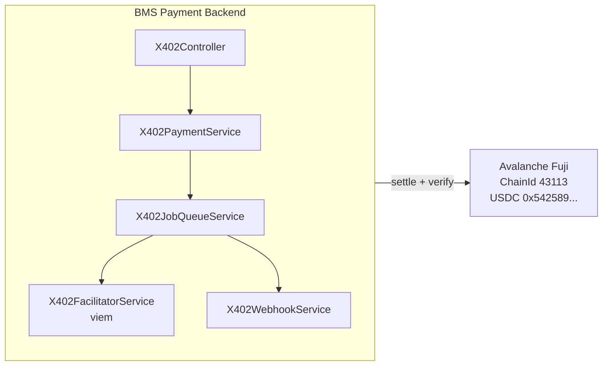
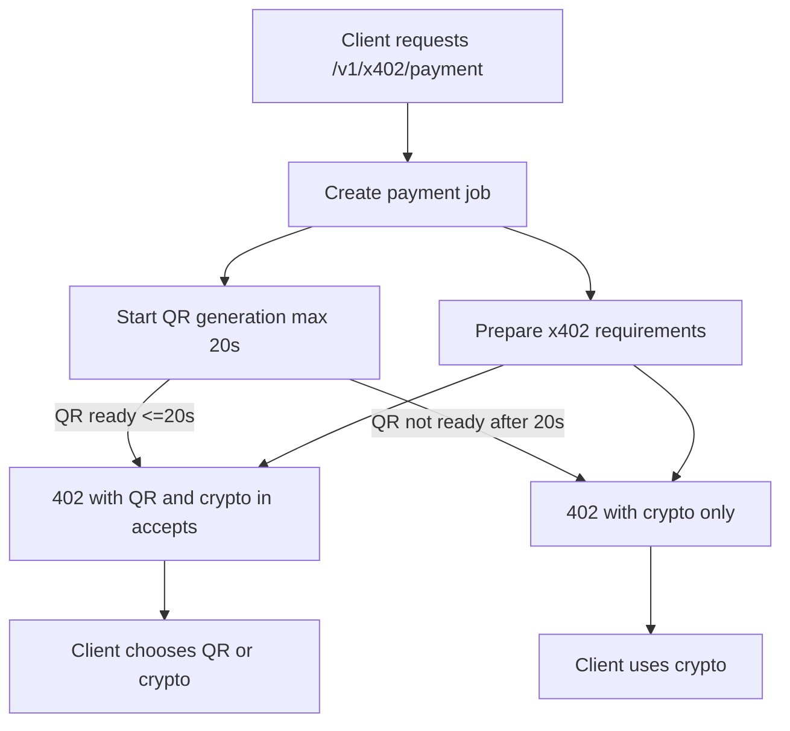
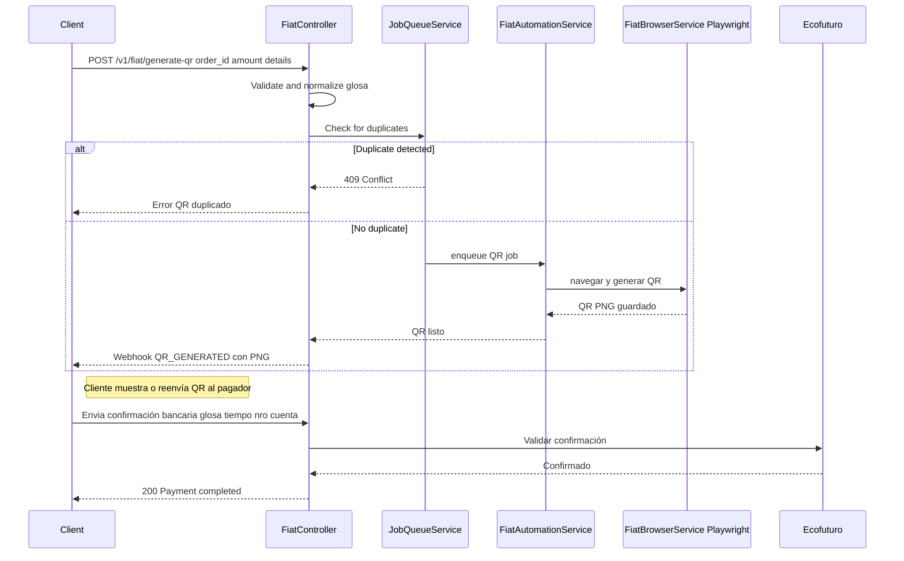
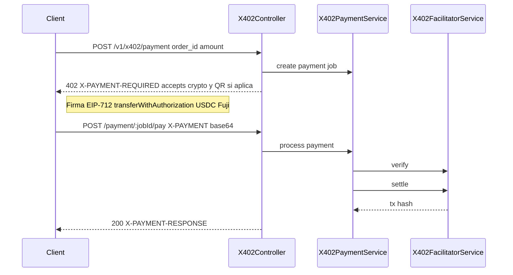
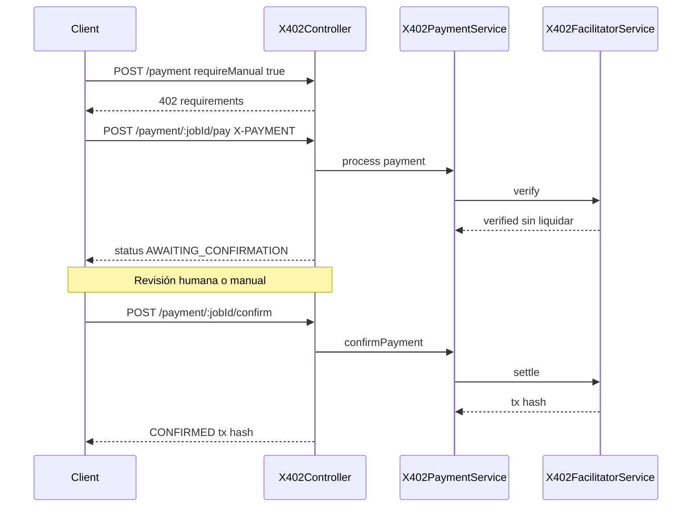
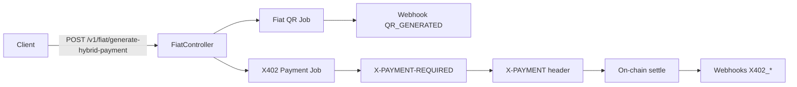

# x402 Payment Protocol Integration

## Overview

This document describes the implementation of the **x402 Payment Protocol** for cryptocurrency payments on **Avalanche Fuji testnet**. The x402 protocol uses the HTTP 402 "Payment Required" status code to enable machine-to-machine payments using stablecoins (USDC).

## Table of Contents

1. [Architecture](#architecture)
2. [Network Configuration](#network-configuration)
3. [Payment Flow](#payment-flow)
4. [API Reference](#api-reference)
5. [Integration with Fiat QR](#integration-with-fiat-qr)
6. [Configuration](#configuration)
7. [Client Implementation](#client-implementation)
8. [Testing](#testing)

---

## Architecture

Key responsibilities:
- `X402Controller`: HTTP 402 responses, header handling.
- `X402PaymentService`: Payment job lifecycle and state machine.
- `X402FacilitatorService`: EIP-712 verification and on-chain settlement (viem).
- `X402JobQueueService`: Sequential processing for crypto jobs.
- `X402WebhookService`: Emits x402 webhook events to backend.

### Component Diagram (Mermaid)



## Network Configuration

### Avalanche Fuji Testnet

| Property | Value |
|----------|-------|
| **Chain ID** | `43113` |
| **Network Name** | Avalanche Fuji C-Chain |
| **Address** | `0x5425890298aed601595a70AB815c96711a31Bc65` |
| **Decimals** | `6` |
| **Name** | USD Coin |
| **Version** | 2 (for EIP-712) |
The flows below use Mermaid diagrams (renderable in many Markdown viewers that support Mermaid).

## Payment Flow

The payment request returns the available methods (QR + crypto) following x402 conventions. If QR generation takes more than 20 seconds, the 402 response only advertises the crypto method. The QR entry in `accepts` includes the price encoded in base64 with its currency type so the client can show or forward the QR without guessing amounts.



### Fiat QR Payment Flow

**Resumen:** genera un QR en Ecofuturo, lo envía por webhook y confirma con payload bancario.

**Validaciones implementadas:**
- **Normalización de glosa**: Se eliminan espacios y caracteres especiales, se convierten a mayúsculas
- **Formato permitido**: Solo letras, números, guiones y guiones bajos (A-Z, 0-9, _, -)
- **Longitud**: Entre 3 y 50 caracteres
- **Prevención de duplicados**: El sistema rechaza QRs con el mismo `orderId` o `glosa/details` dentro de 24 horas



La confirmación de QR implica que el cliente reenvía la información bancaria (glosa, tiempo y número de cuenta) para validar que el pago fue aplicado correctamente antes de cerrar el job.

### x402 Crypto Payment Flow

**Resumen:** pago cripto con autorización EIP-712 y liquidación inmediata (gas pagado por el facilitador). Sin cambios en el flujo cripto.



### x402 Crypto Payment Flow (confirmación manual)

**Resumen:** verificación on-chain, pausa para revisión humana, luego liquidación cuando se confirma.



### Hybrid Payment Flow

**Resumen:** un endpoint dispara ambos métodos: QR y cripto x402. El cliente elige o consume ambos según disponibilidad en el 402.



---
  "createdAt": "2024-01-15T10:00:00Z",
  "updatedAt": "2024-01-15T10:01:00Z"
}
```

### GET /v1/x402/supported

Returns supported networks and tokens.

**Response:**
```json
{
  "networks": [
    {
      "chainId": 43113,
      "name": "avalanche-fuji",
      "displayName": "Avalanche Fuji Testnet",
      "rpcUrl": "https://api.avax-test.network/ext/bc/C/rpc",
      "blockExplorer": "https://testnet.snowtrace.io",
      "usdcAddress": "0x5425890298aed601595a70AB815c96711a31Bc65",
      "usdcDecimals": 6
    }
  ]
}
```

### GET /v1/x402/health

Checks facilitator wallet health.

**Response:**
```json
{
  "status": "healthy",
  "facilitatorAddress": "0x...",
  "usdcBalance": "1000.00",
  "avaxBalance": "5.5",
  "network": {
    "chainId": 43113,
    "name": "avalanche-fuji"
  }
}
```

---

## Integration with Fiat QR

### QR Glosa Validation

Para garantizar la integridad y unicidad de las glosas en los QRs, el sistema implementa las siguientes validaciones:

#### Normalización automática
- **Espacios**: Se reemplazan por guiones (`-`)
- **Mayúsculas**: Todo el texto se convierte a mayúsculas
- **Caracteres especiales**: Se eliminan caracteres no alfanuméricos (excepto `_` y `-`)

**Ejemplo de normalización:**
```
Input:  "BM QR #INV-1001"
Output: "BM-QR-INV-1001"
```

#### Reglas de validación
- **Formato**: Solo se permiten `A-Z`, `0-9`, `_`, `-`
- **Longitud mínima**: 3 caracteres
- **Longitud máxima**: 50 caracteres
- **Mensaje de error**: Se retorna un error 400 si la glosa no cumple con el formato

#### Prevención de duplicados
El sistema mantiene un registro de QRs generados (válido por 24 horas) y previene:
- **Duplicados por `orderId`**: No se permite generar dos QRs con el mismo ID de orden
- **Duplicados por `details/glosa`**: No se permite generar dos QRs con la misma glosa
- **Respuesta HTTP**: `409 Conflict` con mensaje descriptivo

**Ejemplo de respuesta de duplicado:**
```json
{
  "statusCode": 409,
  "message": "Ya existe un QR en proceso o generado para la orden \"ORDER-123\" o glosa \"BM-QR-INV-1001\"",
  "error": "Conflict"
}
```

### Hybrid Payment Flow
The system supports hybrid payments that allow users to choose between fiat QR (Ecofuturo bank) and x402 crypto payments. See the Mermaid diagram in [Payment Flow](#payment-flow) for the orchestration.
### Endpoint: POST /v1/fiat/generate-hybrid-payment

**Request:**
```json
{
  "order_id": "order-123",
  "amount": 100.00,
  "details": "Payment for order #123",
  "payment_method": "HYBRID"
}
```

**Response:**
```json
{
  "status": "accepted",
  "orderId": "order-123",
  "paymentMethods": {
    "fiatQr": {
      "status": "processing",
      "message": "QR code will be sent via webhook"
    },
    "x402Crypto": {
      "jobId": "x402-job-abc",
      "paymentUrl": "/v1/x402/payment/x402-job-abc/pay",
      "paymentRequirements": {
        "accepts": [...],
        "maxAmountRequired": "100000000"
      }
    }
  }
}
```

---

## Configuration

### Environment Variables

Create a `.env` file with the following variables:

```bash
# =============================================================================
# x402 Payment Configuration
# =============================================================================

# Facilitator wallet private key (REQUIRED)
# This wallet pays gas fees and executes transferWithAuthorization
# Must have AVAX on Fuji testnet for gas
X402_FACILITATOR_PRIVATE_KEY=0x...

# Destination address for payments (REQUIRED)
# All USDC payments will be transferred to this address
X402_PAY_TO_ADDRESS=0x...

# Payment timeout in milliseconds (OPTIONAL, default: 300000 = 5 minutes)
X402_PAYMENT_TIMEOUT_MS=300000

# =============================================================================
# Existing Configuration
# =============================================================================

# Webhook URL for payment notifications
OPTUSBMS_BACKEND_URL=https://your-backend.com

# Internal API key for protected endpoints
INTERNAL_API_KEY=your-secret-key
```

### Getting Testnet Tokens

1. **AVAX (for gas fees):**
   - Visit the [Avalanche Fuji Faucet](https://faucet.avax.network/)
   - Connect your facilitator wallet
   - Request testnet AVAX

2. **USDC (for testing payments):**
   - The testnet USDC at `0x5425890298aed601595a70AB815c96711a31Bc65` can be obtained from various testnet faucets
   - Or deploy your own test token for development

---

## Client Implementation

### JavaScript/TypeScript Example

```typescript
import { createWalletClient, http, parseUnits } from 'viem';
import { avalancheFuji } from 'viem/chains';
import { privateKeyToAccount } from 'viem/accounts';

const USDC_ADDRESS = '0x5425890298aed601595a70AB815c96711a31Bc65';

// EIP-712 Domain for USDC on Fuji
const domain = {
  name: 'USD Coin',
  version: '2',
  chainId: 43113,
  verifyingContract: USDC_ADDRESS,
};

// EIP-712 Types for transferWithAuthorization
const types = {
  TransferWithAuthorization: [
    { name: 'from', type: 'address' },
    { name: 'to', type: 'address' },
    { name: 'value', type: 'uint256' },
    { name: 'validAfter', type: 'uint256' },
    { name: 'validBefore', type: 'uint256' },
    { name: 'nonce', type: 'bytes32' },
  ],
};

async function makeX402Payment(orderId: string, amount: number) {
  const account = privateKeyToAccount('0x...');
  const walletClient = createWalletClient({
    account,
    chain: avalancheFuji,
    transport: http(),
  });

  // Step 1: Request payment requirements
  const initResponse = await fetch('http://localhost:3000/v1/x402/payment', {
    method: 'POST',
    headers: { 'Content-Type': 'application/json' },
    body: JSON.stringify({ order_id: orderId, amount }),
  });

  if (initResponse.status !== 402) {
    throw new Error('Expected HTTP 402');
  }

  const requirements = JSON.parse(
    initResponse.headers.get('X-PAYMENT-REQUIRED')!
  );
  const { jobId, accepts } = requirements;
  const paymentOption = accepts[0];

  // Step 2: Create EIP-712 authorization
  const nonce = `0x${crypto.randomUUID().replace(/-/g, '')}`;
  const validBefore = Math.floor(Date.now() / 1000) + 300; // 5 minutes

  const authorization = {
    from: account.address,
    to: paymentOption.payToAddress,
    value: BigInt(paymentOption.maxAmountRequired),
    validAfter: 0n,
    validBefore: BigInt(validBefore),
    nonce,
  };

  // Step 3: Sign the authorization
  const signature = await walletClient.signTypedData({
    domain,
    types,
    primaryType: 'TransferWithAuthorization',
    message: authorization,
  });

  // Step 4: Create payment payload
  const payload = {
    x402Version: 1,
    scheme: 'exact',
    network: 'avalanche-fuji',
    payload: {
      signature,
      authorization: {
        from: authorization.from,
        to: authorization.to,
        value: authorization.value.toString(),
        validAfter: authorization.validAfter.toString(),
        validBefore: authorization.validBefore.toString(),
        nonce,
      },
    },
  };

  // Step 5: Submit payment
  const payResponse = await fetch(
    `http://localhost:3000/v1/x402/payment/${jobId}/pay`,
    {
      method: 'POST',
      headers: {
        'X-PAYMENT': Buffer.from(JSON.stringify(payload)).toString('base64'),
      },
    }
  );

  const result = JSON.parse(
    payResponse.headers.get('X-PAYMENT-RESPONSE') || '{}'
  );
  
  if (result.success) {
    console.log('Payment successful!');
    console.log('Transaction:', result.transactionHash);
  }

  return result;
}
```

---

## Testing

### Unit Tests

```bash
# Run all tests
npm test

# Run x402-specific tests
npm test -- --grep x402
```

### Manual Testing with cURL

```bash
# 1. Create payment job
curl -X POST http://localhost:3000/v1/x402/payment \
  -H "Content-Type: application/json" \
  -d '{"order_id": "test-001", "amount": 1.00}' \
  -v

# Note the X-PAYMENT-REQUIRED header and jobId

# 2. Check supported networks
curl http://localhost:3000/v1/x402/supported

# 3. Check health
curl http://localhost:3000/v1/x402/health

# 4. Check payment status
curl http://localhost:3000/v1/x402/payment/{jobId}/status
```

### Test Scenarios

| Scenario | Steps | Expected Result |
|----------|-------|-----------------|
| Happy path | Create → Pay → Verify | SETTLED status, tx hash |
| Manual confirm | Create (manual=true) → Pay → Confirm | CONFIRMED status |
| Invalid signature | Create → Pay (bad sig) | FAILED status, error |
| Expired payment | Create → Wait 5+ min → Pay | EXPIRED status |
| Check status | Create → Get status | PENDING status |

---

## Webhooks

### Event Types

| Event | When Triggered |
|-------|----------------|
| `X402_PAYMENT_REQUIRED` | Payment job created |
| `X402_PAYMENT_VERIFIED` | Signature verified |
| `X402_PAYMENT_SETTLED` | On-chain transfer complete |
| `X402_PAYMENT_CONFIRMED` | Manual confirmation processed |
| `X402_PAYMENT_FAILED` | Any error occurred |
| `X402_PAYMENT_EXPIRED` | Payment timed out |

### Webhook Payload Example

```json
{
  "type": "X402_PAYMENT_SETTLED",
  "jobId": "job-abc",
  "orderId": "order-123",
  "data": {
    "amount": 10.5,
    "amountAtomic": "10500000",
    "transactionHash": "0x...",
    "blockExplorerUrl": "https://testnet.snowtrace.io/tx/0x..."
  },
  "timestamp": "2024-01-15T10:01:00.000Z"
}
```

---

## Security Considerations

1. **Private Key Protection:** Never commit `X402_FACILITATOR_PRIVATE_KEY` to version control. Use environment variables or secrets management.

2. **Gas Funding:** Monitor the facilitator wallet's AVAX balance. If it runs out, payments will fail.

3. **Signature Verification:** All EIP-712 signatures are verified on-chain by the USDC contract. Invalid signatures are rejected.

4. **Nonce Uniqueness:** Each payment uses a unique nonce to prevent replay attacks.

5. **Time Bounds:** Payments have `validBefore` timestamps to prevent stale authorizations.

6. **Manual Confirmation:** Use `requireManualConfirmation: true` for high-value payments that need human review.

---

## Troubleshooting

### Common Issues

| Issue | Cause | Solution |
|-------|-------|----------|
| "Facilitator has insufficient AVAX" | No gas funds | Fund facilitator wallet with AVAX |
| "Invalid signature" | Wrong signer or domain | Check EIP-712 domain matches |
| "Payment expired" | Too slow | Increase timeout or pay faster |
| "Nonce already used" | Replay attempt | Generate new nonce |
| "Insufficient USDC balance" | Client has no USDC | Client needs to get testnet USDC |

### Debug Logging

Enable debug logs by setting:

```bash
DEBUG=x402:*
```

Or check Nest logger output for `X402*` prefixed messages.
